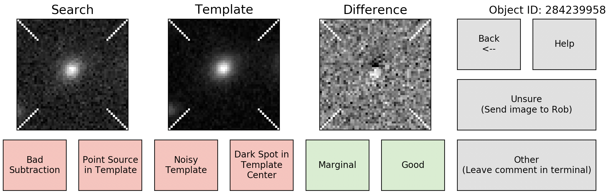

# ArtifactSpy

Label DECam difference images for CNN-based artifact detection

## Installation and Setup

```
git clone https://github.com/rmorgan10/ArtifactSpy.git
cd ArtifactSpy
chmod +x ArtifactSpy
```

## An Important Note

The difference images you are presented when using `ArtifactSpy` are from comparing DES Y6 images to DES SV-Y5 images across the entire footprint.
**No one in the world has inspected these images yet.**
The golden rule for using this tool is "If you see something, say something."
Maybe you'll find a new gravitational lensing system; maybe you'll find new classes of image artifacts; maybe you'll find aliens.
In any of these three scenarios, make note of the "Object ID" in the upper right corner of the graphic user interface, and let Rob Morgan know about it.

## Usage

Start ArtifactSpy with the command

```
./ArtifactSpy
```

This will open up the graphic user interface for labeling images:



Based on what you see in the image, click the most appropriate box. When you are finished, just close the graphic user interface. Please do not terminate the program by entering `Crtl+C` in the terminal as your labels will not be uploaded to the database.

## How to Label Difference Images

##  Behind the Scenes