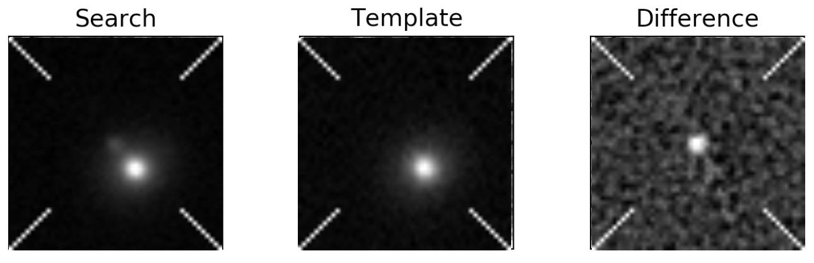
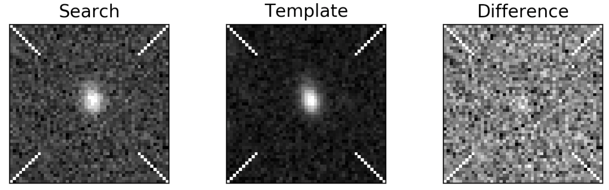

# ArtifactSpy

Label DECam difference images for CNN-based artifact detection

## Installation and Setup

```
git clone https://github.com/rmorgan10/ArtifactSpy.git
cd ArtifactSpy
chmod +x ArtifactSpy
```

As you work through images, `ArtifactSpy` will automatically download new data for you when you are running low, and when you finish it will automatically send your results to the HEP cluster database.
Because it does a lot of this type of thing, you will have a much smoother experience if you configure your computer to get a Kerberos ticket from HEP.WISC.EDU to avoid having to enter your password frequently.
Information on setting this up can be found [here](https://wp.physics.wisc.edu/computing/ssh/#passwordless).

_Aside_: Do not set up ssh-keys on the HEP cluster to avoid entering your password. Use Kerberos.

## An Important Note

The difference images you are presented when using `ArtifactSpy` are from comparing DES Y6 images to DES SV-Y5 images across the entire footprint.
**No one in the world has inspected these images yet.**
The golden rule for using this tool is "If you see something, say something."
Maybe you'll find a new gravitational lensing system; maybe you'll find new classes of image artifacts; maybe you'll find aliens.
In any of these three scenarios, make note of the "Object ID" in the upper right corner of the graphic user interface, and let Rob Morgan know about it.

## Usage

Start ArtifactSpy with the command

```
./ArtifactSpy
```

This will open up the graphic user interface for labeling images:


Based on what you see in the image, click the most appropriate box. When you are finished, just close the graphic user interface. Please do not terminate the program by entering `Crtl+C` in the terminal as your labels will not be uploaded to the database.

## How to Label Difference Images

### The difference imaging process

Difference imaging is a technique used to find astronomical objects with changing brightness. At the most basic level, the procedure is to subtract a recent image from a previous image of the same part of the sky, and if anything remains then we conclude that the brightness of at least one object in the image has changed. In `ArtifactSpy`, "Search" refers to the most recent image, "Template" refers to the previous image of the same part of the sky, and "Difference" refers to the subtracted result of the "Search" and "Template" images.

For a more in-depth overview that is still largely accessible, check out this [Darchive summary](https://www.darkenergysurvey.org/darchive/the-difference-imaging-pipeline-for-the-transient-search-in-the-dark-energy-survey/) written by Rick Kessler.

This process is not perfect, however: slight misalignments between the "Search" and "Template" images can lead to inaccurate subtractions; bright galaxy centers can mess with some of the under-the-hood psf fitting used to perform the subtraction; problems in the template image can immitate a variable-brightness object; and variable stars and moving objects can be picked up in large numbers even when they may not be of interest.

Human vetting is one of the main tools for catching all those issues, but as the sizes of astronomical datasets increase, we need to develop tools to automatically spot these artifacts. Here lies the purpose of `ArtifactSpy`: build a large human-labeled set of difference images for a machine learning algorithm to train on.

### When to use each button

Let's go over each button individually and discuss the appropriate situations for selecting it.

**Bad Subtraction**: When you see a bright and dark dipole in the difference image.


This pattern in the difference image is caused by a slight misalignment of the Search and Template images. Thus, when the subtraction is performed, under- and over-subtracted regions appear in the difference image, even though no physical change in brightness may have occurred.

**Point Source in Template**: When a non-extended, circular, object is positioned in the exact center of the template.


This case is very likely to be a foreground star in the Milky Way that has some variable brightness. There are some cases where you will see an accompanying galaxy, but as long as there is point source in the exact center of the "Template", then it means the object picked up by difference imaging has been detected previously.

**Noisy Template**: When the template is too noisy to make out any objects by eye.


A noisy template can cause make it difficult to detect a faint object, even if it has variable brightness. 

**Dark Spot in Template Center**: If a black spot is positioned exactly in the center of the template image.


This one is subtle, espicially since the difference image looks like a real object. However, upon closer inspection, you will notice that there are multiple adjacent pixels with an underfluctuation of noise in the center of the template image, which registers as a difference from the flat sky in the search image. This is not a real object, and the detection is a product of an issue in the template image.

**Good**: When you see a point source in the center of the search image, a host galaxy for that transient in the search image, only the host galaxy in the template, and only the point source in the difference image.



What a beaut!

Here you can see a galaxy in the template image. In the more recent search image you see the galaxy with a point source. In the difference image you see a clean subtraction where only the point source remains.

**Marginal**: When you could be reasonably convinced you are looking at a real transient in a host galaxy, but maybe there is some noise or other weirdness going on that makes it less than optimal.




Here are two examples of what I would label marginal. In both cases, the object in the template is extended, indicating that it is a galaxy, and off-center, indicating that it is not the object that triggered the difference image detection. I label these as marginal because I cannot by eye detect a point source within the host galaxy in the search image, and I really have to squint to see a point source in the center of the difference image.

It is likely that in these cases, the difference imaging pipeline detected a real transient that is too close to the center of the galaxy to be resolved. 

### My overall thought process

1. Look at the difference image
    1. Do you see a white and black dipole? If yes `Bad Subtraction`

1. Look at the template image
    1. Do you see a point source in the center? If yes `Point Source in Template`
    1. Do you see a dark spot in the center? If yes `Dark Spot in Template`

1. Look at all three images together
    1. Can you make out any astrophysical objects? If no `Noisy Template`
    1. Do you see a transient in a host galaxy in the source, the host galaxy by itself in the template, and the transient by itself in the difference image? If yes `Good`
    1. Given reasonable amounts of noise and positioning effects, could you be convinced that you're still looking at a host-plus-transient system? If yes `Marginal`
    
1. Does it not fit into any of the above catagories and you have a comment to leave about it? If yes `Other`, and type your comment in the terminal
1. Does it not fit into any of the above catagories and you have no idea what you're looking at? If yes `Unsure`. You can also post a screenshot in the #artifactspy channel on Slack or send one to Rob Morgan.

##  Behind the Scenes

Holy cow is there a lot of behind the scenes stuff going on.

- For the scripts that organize DES data and make it available on the HEP cluster, visit the [ArtifactSpy-Admin](https://github.com/rmorgan10/ArtifactSpy-Admin) repo.
- For the scripts that organize results and queue up new data, visit the [ArtifactSpy-Database](https://github.com/rmorgan10/ArtifactSpy-Database) repo.